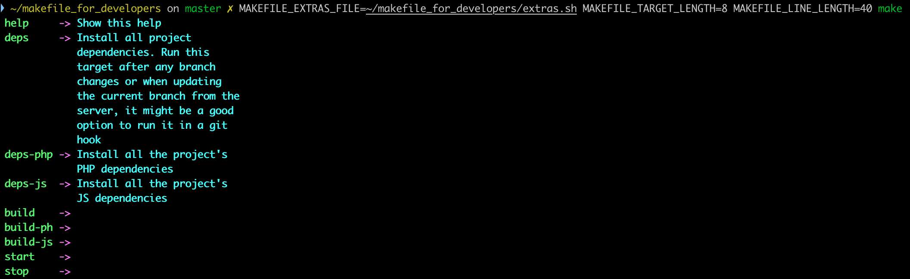

# Cómo usarlo
- Antes de empezar comprueba tu versión de make esto está testeado con la versión 3.81 y la 4.3 en un mac, pero mejor empieza por leer la sección de "errores"

- Quedate en el la carpeta del repositorio que te has descargado
    ```
    cd ~/makefile_for_developers
    ```

- Ahora ejecuta make
    ```
    make 
    ```
  tristemente obtendremos algo similar a esto:
  
  esto ocurre porque por defecto el Makefile no sabe donde encontrar las funciones de ayuda para pintarlo todo un poco más bonito.

- Ahora le pasaremos la configuración en línea para ver un resultado más apropiado, más tarde veremos como dejarlo todo bien configurado.
    ```
    MAKEFILE_EXTRAS_FILE=~/makefile_for_developers/extras.sh make
    ```
  ahora obtendremos algo similar a esto:
  

- Ahora le cambiaremos el tamaño de la columna de los targets.
    ```
    MAKEFILE_EXTRAS_FILE=~/makefile_for_developers/extras.sh MAKEFILE_TARGET_LENGTH=8 make
    ```
  y ahora algo similar a esto:
  
  la columna de letras verdes se ha estrechado, pero el ancho total de la salida sigue teniendo el mismo tamaño.
  
- Ahora le cambiaremos el ancho máximo de la salida.
    ```
    MAKEFILE_EXTRAS_FILE=~/makefile_for_developers/extras.sh MAKEFILE_TARGET_LENGTH=8 MAKEFILE_LINE_LENGTH=40 make
    ```
  y obtenemos algo parecido a esto:
  
  la columna de letras verdes se ha estrechado, pero el ancho total de la salida sigue teniendo el mismo tamaño.


## Configuración
Sin "dotly" la forma más sencilla es editar nuestro .bashrc o .zshrc y añadir estas líneas:
```
export MAKEFILE_EXTRAS_FILE=/usr/local/bin/extras.sh
export MAKEFILE_TARGET_LENGTH=20
export MAKEFILE_LINE_LENGTH=80
```

Si usas "dotly" seguramente quieras añadir estas líneas en tu fichero $DOTFILES_PATH/shell/_exports/exports.sh
```
export MAKEFILE_EXTRAS_FILE=$DOTFILES_PATH/utils/make/extras.sh
export MAKEFILE_TARGET_LENGTH=20
export MAKEFILE_LINE_LENGTH=80
```

si no se definen las variables MAKEFILE_TARGET_LENGTH y MAKEFILE_LINE_LENGTH el script toma por defecto los valores 20 y 80 respectivamente.
si no se define MAKEFILE_EXTRAS_FILE apuntando al fichero extras.sh no se formatea la salida

si no quiere definir las variables puede crear un alias:
alias make='MAKEFILE_EXTRAS_FILE=$DOTFILES_PATH/utils/make/extras.sh MAKEFILE_TARGET_LENGTH=8 MAKEFILE_LINE_LENGTH=40 make'

## Errores
Comprueba tu versión de make
```
    make -v
```
si es la 4.3 todo perfecto, si es superior espero que ningún problema (pero solo está testeado con  la 4.3)
si es inferir a la 4.3 y al ejecutar make te aparece algo como esto:

básicamente "command not found: make_help" es que tu versión no es del todo compatible y hay un  par de soluciones:

1. Primera, actualiza tu make

    Usa tu gestor de dependencias para actualizarte a una versión más moderna (apt, yum, apk)

    En mac:
    ```
    brew install make
    ln -s /usr/local/opt/make/bin/gmake /usr/local/bin/make
    ```

2. Segunda, modifica el Makefile

    El error se produce porque en "make" cada línea se ejecuta con una shell distinta (por defecto /bin/sh) lo cual además de ineficiente nos provoca este problema, en una línea hacemos source del fichero de las funciones de ayuda (extras.sh) y entre otras queda definida la función "make_help", pero cuando se ejecuta la segunda línea se hace en un shell distinto por lo cual "make_help" la función definida en la línea anterior no existe en este shell.

    En las versiones modernas de "make" esto se soluciona con el target ".ONESHELL" antes del target real, en este caso "help".

    Pero en versiones anteriores tenemos que recurrir a escribir todos los comando en una línea separados por ";" o separarlo en varias usando "\\" 
    
    es decir cambiar el Makefile de esto:
    
    por este otro:
    

